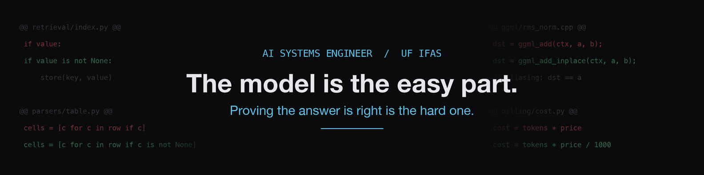

# Yash Raj Pandey

**AI systems engineer at UF/IFAS**

I work on the layer where AI systems quietly go wrong, and I prove it.

&nbsp;&nbsp;

&nbsp;&nbsp;

&nbsp;&nbsp;

&nbsp;&nbsp;

Most of my side projects start with a bug I could not leave alone.

## What I work on

At UF/IFAS I build and run AI systems for scientific research. One constraint
shapes everything else: research data stays on infrastructure the university
controls.

The model is the easy part. You download it and it answers. The hard part is
working out what the question was before any model runs, getting clean text out
of documents that resist it, and proving an answer is right before a scientist
acts on it. A confident wrong number is worse than an error.

Some of what that has meant:

- About twenty routing rules, each correct on its own, collided in production. I
  replaced them with one deterministic arbiter that can be read and tested.
- A hand-written agent loop grew until one tool failure could stop the whole
  assistant. I replaced it with a proven framework, and shipped it only after it
  beat the old one on a held-out set.
- Every number in an answer traces back to the tool result it came from.
- An alarming document-quality metric turned out to be a measurement bug, not
  damaged text. Check the alarm before you act on it.

I also lead a data platform for agricultural research. It brings scattered
spreadsheets into one system of record: about 1.5 million research records, used
by more than 30 researchers across five labs.

I joined UF/IFAS in March 2025 after my MS at the University of Florida. Two
promotions since. I am now the AI Agents Architect.

## Projects

| Project | What it does |
|---|---|
| [Podium](https://github.com/devYRPauli/podium) | Runs delegated coding work with acceptance checks and durable receipts. |
| [Baton](https://github.com/devYRPauli/baton) | The earlier delegation system that led to Podium, with durable jobs, focused briefs, and independent verification. |
| [Looma](https://github.com/devYRPauli/looma) | Turns coding-agent history into resumable project context. Local-first, zero dependencies, and available on PyPI. |
| [willitcall](https://github.com/devYRPauli/willitcall) | Tests tool calling across local models, quantizations, templates, and inference servers. |
| [mddocs](https://github.com/devYRPauli/mddocs) | Adds real-time collaboration, comments, suggestions, and an agent API to Markdown files stored in git. |
| [TabFM evaluation](https://github.com/devYRPauli/tabfm-evaluation) | Reproduces Google's TabFM across three machines and 13 datasets, including baselines, failure analysis, and upstream fixes. |
| [TurboQuant evaluation](https://github.com/devYRPauli/turboquant-m1pro-evaluation) | Tests KV-cache compression on a 16 GB M1 Pro across MLX and llama.cpp. |
| [Portfolio](https://github.com/devYRPauli/portfolio) | The text-first Astro site for my work, writing, and project notes. |
| [World Cup 2026 Picks](https://github.com/devYRPauli/world-cup-2026-picks) | A self-hosted prediction pool with live scoring, group picks, knockout picks, and final results. |
| [Football Hub](https://github.com/devYRPauli/football-hub) | A live football dashboard for standings, fixtures, and top scorers across seven competitions. |
| [ApplyScore](https://yashrajpandey.com/work/applyscore/) | A Chrome extension for comparing a resume with a job posting. |

## Open source

**84 merged pull requests across 38 external projects.** Almost none of them are
features. Most are the class of bug that returns a plausible wrong answer
instead of an error.

| Project | Stars | Merged | What I work on there |
|---|---|---|---|
| [llama.cpp](https://github.com/ggml-org/llama.cpp/pulls?q=is%3Apr+author%3AdevYRPauli+is%3Amerged) | 125k | 3 | Kernels. Wrong gradients under in-place aliasing. A routing table that must not be quantized. |
| [RAGFlow](https://github.com/infiniflow/ragflow/pulls?q=is%3Apr+author%3AdevYRPauli+is%3Amerged) | 89k | 16 | Document parsers. Dropped table cells, spliced CSV fields, crashes on valid input. |
| [Mem0](https://github.com/mem0ai/mem0/pulls?q=is%3Apr+author%3AdevYRPauli+is%3Amerged) | 64k | 4 | Retrieval and vector store correctness. |
| [LiteLLM](https://github.com/BerriAI/litellm/pulls?q=is%3Apr+author%3AdevYRPauli+is%3Amerged) | 57k | 3 | Billing. People pay these numbers. |
| [Agno](https://github.com/agno-agi/agno/pulls?q=is%3Apr+author%3AdevYRPauli+is%3Amerged) | 41k | 1 | A reader that took the user id from the wrong field. |
| [MLX](https://github.com/ml-explore/mlx/pulls?q=is%3Apr+author%3AdevYRPauli+is%3Amerged) | 28k | 2 | Undefined behavior in shape arithmetic. |
| [CodexBar](https://github.com/steipete/CodexBar/pulls?q=is%3Apr+author%3AdevYRPauli+is%3Amerged) | 20k | 8 | Pricing tables, quota display, reset-date rollover, cache-token accounting. |
| [txtai](https://github.com/neuml/txtai/pulls?q=is%3Apr+author%3AdevYRPauli+is%3Amerged) | 12k | 1 | Embeddings and retrieval correctness. |
| [pypdf](https://github.com/py-pdf/pypdf/pulls?q=is%3Apr+author%3AdevYRPauli+is%3Amerged) | 10k | 1 | PDF parsing, which sits under most ingestion pipelines. |

The other 45 are spread across 29 smaller projects: mlx-lm, turboquant_plus, and
a long run through Peter Steinberger's tool ecosystem. One is
[google-research/tabfm](https://github.com/google-research/tabfm/pull/42), where
prediction crashed on multi-device hosts. I found that during my own evaluation
of the model, which is the short version of how most of these start.

Another 31 pull requests are open. When I cannot fix something myself I file the
reproduction instead, which is where my 10 upstream issues come from.

[See every external merged pull request](https://github.com/search?q=is%3Apr+author%3AdevYRPauli+is%3Amerged+-user%3AdevYRPauli&type=pullrequests).

## Writing

- [The Work You Don't Do: Losing Two Optimization Competitions the Same Way](https://yashrajpandey.com/writing/the-work-you-dont-do/)
- [Eight Submissions, Zero Promotions: A Week Inside mlx.fast on the Wrong Hardware](https://yashrajpandey.com/writing/eight-submissions-zero-promotions/)
- [I Tried to Break Google's New Tabular Foundation Model. Then I Fixed It.](https://yashrajpandey.com/writing/breaking-google-tabfm/)
- [Same Weights, Opposite Results: Testing Tool Calling Across Local Inference Stacks](https://yashrajpandey.com/writing/same-weights-opposite-results/)

I mostly work in Python, TypeScript, Rust, SQL, C, C++, and Bash. Outside work,
I follow football, play tactical shooters and story-rich RPGs, and listen to
lo-fi while I build.
